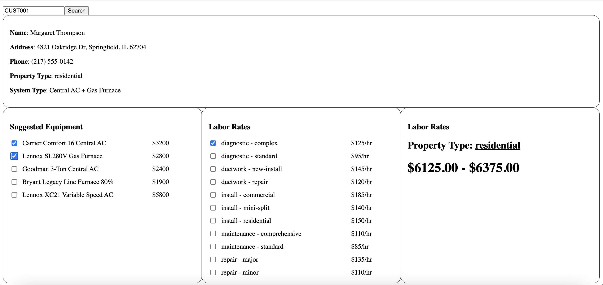

# Field Estimate Tool

## My Solution

The problem is evident, it takes way too much time to create a cost estimate for HVAC work to be done. It hurts the business, it loses clients, and it's not efficient.

I created a full-stack web app that quickly generates a cost estimate based off of the customer's information. Their system and property types are used to create a base cost of equipment, and labor rates are calculated in lump sum with the base costs, accurately grabbing a minimum and maximum total estimate.

This process takes no less than five minutes of a full conversation with the client before reaching a final quote range.

It's simple: 1) enter the customer's ID, 2) select what equipment they need, 3) they choose what labor we offer, and 4) they obtain a price estimate.

## Thought Process

### Why a Go backend?

In my first version, I did a simple static website parsing out the JSON files and hard-coding buttons, and checklists. This is not sustainable and definitely not scalable, thus I made the long (but worth it) decision to implement a full backend.

With the backend, the data is hidden from the frontend. This is good coding practice and you I believe you shouldn't expose `data/` anywhere near the frontend.

I chose a Go backend because I've had prior experience interacting with REST API endpoints, and with this project I've had to create and interact with my own REST API endpoints.

Further, JavaScript / JSX syntax is hard to follow when switching between languages and I did not want to do any server-side programming using JSX. Go allowed me to use a MySQL driver making my job a million times easier, but it also allowed me freedom to implement features along the way seamlessly.

### Why MySQL? Why even use a database?

I like to thing long-term. I like to think scalable, and efficient. I like to thing, if I were to hand this off to a client / customer right now, would they be happy?

If you scale Customers.json to 1000 entries, would parsing out Customers.json and hard-coding be efficient? Usually, no. What if the company adds 500 new equipment to inventory? What if California's labor rate changes drastically and adds 200 more entries into labor rates?

Therefore, I chose to incorporate a database to store equipment information, labor rate information, and customer information accordingly.

The hardest part was figuring out a way to connect the pieces of information accordingly. Luckily, `systemType` provided a way to _categorize_ equipment to a specific sector. Though my solution may be general at the current version, thanks to a database, it would be simpler later down the line to account for additional equipment. Right now, I match equipment based off of system type e.g., Central AC -> Air Conditioner.

I left `labor_rates` untouched, I believed that a customer might feel they need labor rate categories that are completely distinct from each other, so they have the opportunity to choose what they feel is necessary to get the job done. They don't necessarily need to be adjacent to each other.

### Why Docker?

I ran into issues updating MySQL on my system and authenticating. I also ran into issues listening and serving my backend on a port. I thought about what would make this process easier and more accessible to a client (you!) and thus I incorporated the usage of Docker so all you need to do is have Docker Desktop installed and run one, singular command, as opposed to 1) installing mysql, 2) connecting a mysql account, 3) creating a databse called hvac_service, installing, 4) downloading React and Go packages and dependencies, and so on.

## Tech Stack

- React + Vite
- Go
- GORM (MySQL Driver)
- MySQL
- Docker / Docker Compose

## Quickstart

1. Install `Docker Desktop` and ensure `Docker Desktop` is running.
2. `git` clone the repository
3. `cd` into `Full-Stack-Dev-Test`
4. run `docker compose up --build`
   - To tear down a previously ran container, just run `docker compose down` then run `docker compose up --build` again.
5. Open `http://localhost:5173/`

## Sample

## The Problem

Our HVAC technicians are losing time on every service call.

Right now, when a tech gets to a job site and needs to give the customer an estimate, here's what happens: they flip through a product binder or scroll through a spreadsheet on their phone, look up equipment costs, try to remember the labor rates for different job types, factor in the specifics of the property, and then scribble numbers on a notepad or punch them into a calculator. Sometimes they call the office to double-check pricing. Sometimes they guess and adjust later.

The customer is standing there the whole time.

A simple repair estimate might take 10-15 minutes. A full system replacement quote can take 30-45 minutes on-site, and that's before the tech has to go back to their truck to write it up in a way the customer can actually read. Some techs text a photo of their handwritten notes to the office and have someone there type it up. Others just wing it and send a "real" estimate later that evening.

We've got about 40 technicians in the field. If each one does 4-6 estimates a day, that's a lot of wasted time — and a lot of customers standing around waiting. We've heard from customers that the wait makes the whole experience feel less professional, and we've definitely lost jobs because a competitor got a clean estimate out faster.

## What We Have

In the `data/` folder, you'll find some of the information our techs work with:

- **equipment.json** — Our catalog of HVAC equipment and parts with pricing
- **labor_rates.json** — What we charge for different types of work
- **customers.json** — A sample of customer and property records

This is real-ish data pulled from our systems. It's not perfect — some of it was exported from different tools at different times, so it might not all look the same.

## What We're Asking

Build something that helps.

Fork this repo, build your solution, and include a short write-up explaining your approach — what you built, why you made the choices you did, and what you'd do differently with more time.
